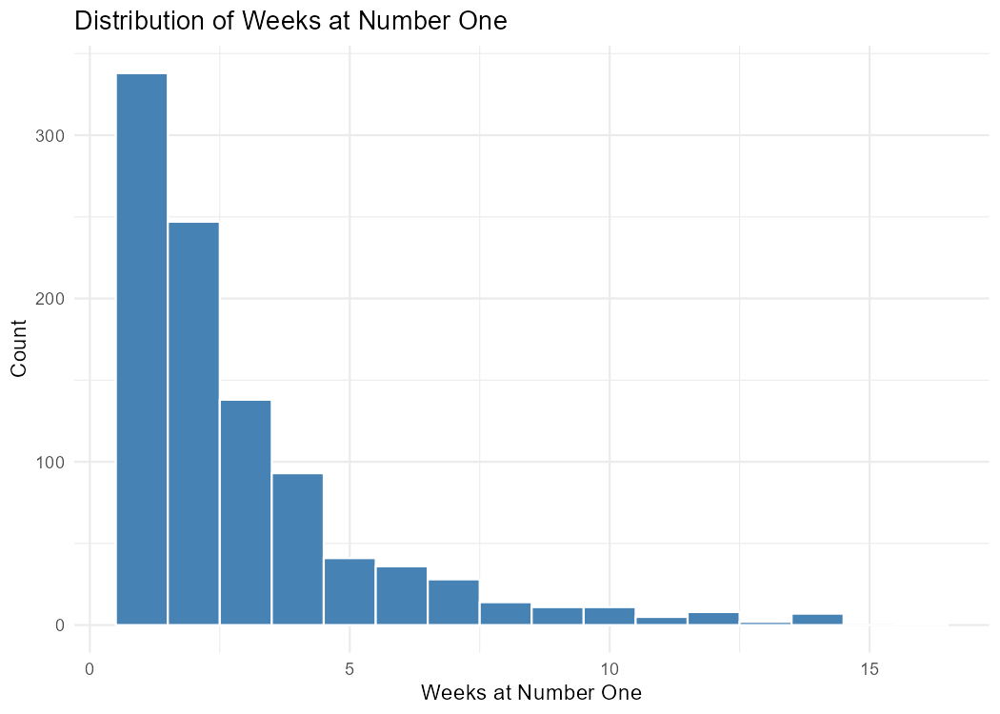
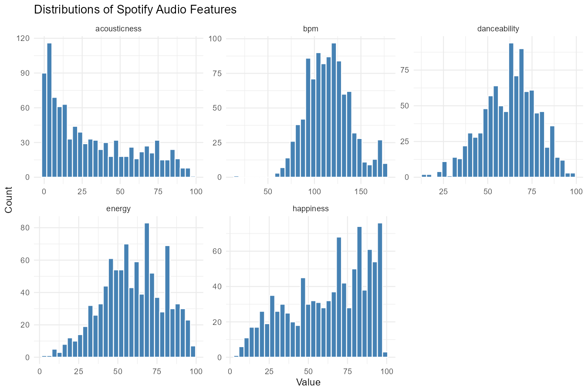
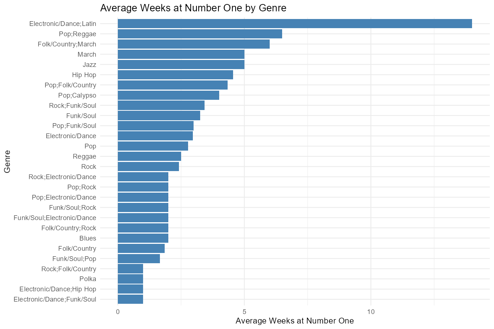
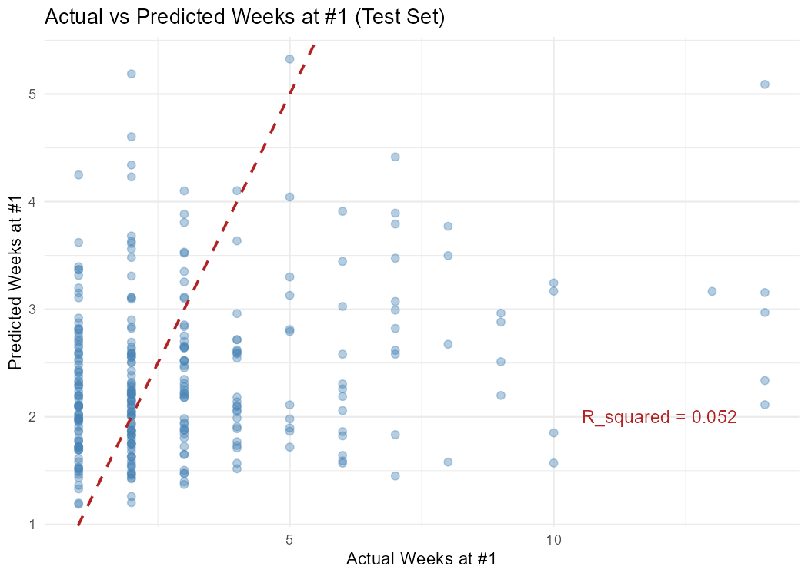
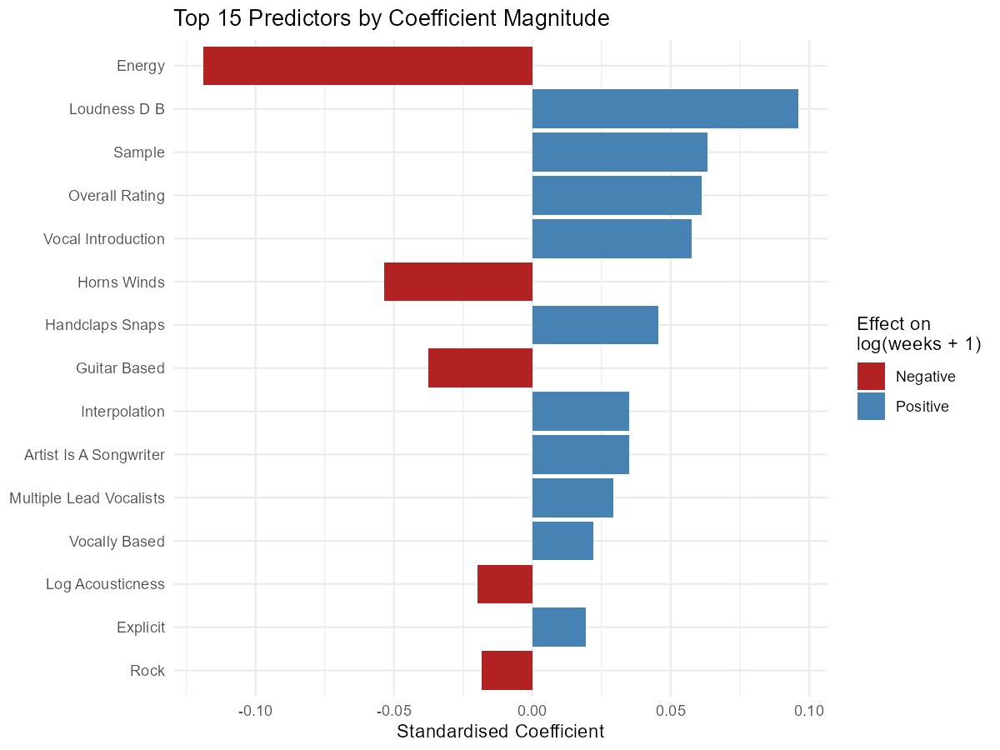

```{r setup}
summary_stats <- readr::read_csv("../results/tables/summary_stats.csv", show_col_types = FALSE)
cv_metrics <- readr::read_csv("../results/tables/cv_metrics.csv", show_col_types = FALSE)
test_metrics <- readr::read_csv("../results/tables/test_metrics.csv", show_col_types = FALSE)
coef_data <- readr::read_csv("../results/tables/top_15_coefficients.csv", show_col_types = FALSE)

cv_rmse <- cv_metrics |> dplyr::filter(.metric == "rmse") |> dplyr::pull(mean)
cv_rsq <- cv_metrics |> dplyr::filter(.metric == "rsq") |> dplyr::pull(mean)
cv_mae <- cv_metrics |> dplyr::filter(.metric == "mae") |> dplyr::pull(mean)

test_rmse <- test_metrics |> dplyr::filter(.metric == "rmse") |> dplyr::pull(.estimate)
test_rsq <- test_metrics |> dplyr::filter(.metric == "rsq") |> dplyr::pull(.estimate)
test_mae <- test_metrics |> dplyr::filter(.metric == "mae") |> dplyr::pull(.estimate)

energy_beta <- coef_data |> dplyr::filter(term == "energy") |> dplyr::pull(estimate)
loudness_beta <- coef_data |> dplyr::filter(term == "loudness_d_b") |> dplyr::pull(estimate)
rating_beta <- coef_data |> dplyr::filter(term == "overall_rating") |> dplyr::pull(estimate)
```

# Summary

The objective of this analysis is to use publicly available song information from the Billboard Hot 100 song rankings to investigate the question:

**Given various metrics about a song (energy, beats per minute, etc.), how many weeks, if any, will a song remain at the top position in the Billboard Hot 100 rankings? Which features contribute most to our model’s predictions?**

# Introduction

The magazine “Billboard” is a leading source of information on trends in music popularity and innovation. Following the launch of the magazine in 1958, weekly rankings of the top 100 songs in the US have been made publicly available [@billboard]. The dataset that we have selected is open-source Tidy Tuesday [@tidytuesday] dataset which documents these billboard rankings from August 4th 1958, until January 11th 2025. It provides features such as lyrics, song-structure, and featured_artists for each song in the ranking. These features can then be used for song popularity predictions or music trend forecasting. In this analysis, we use linear regression to predict the number of weeks a song remains at the #1 spot in the rankings, and assess our model’s performance using RMSE, MAE and $R^2$. Even though our results show that our regressor has a weak performance, information regarding feature importances in model decision-making remain useful in determining a song’s overall popularity.

# Methods and Results

## Overview of our Methodology

The Billboard Hot 100 dataset provides us with two datasets: `billboard.csv`, which contains one row per song that reached #1 along with its features, and `topics.csv`, a reference list of lyrical theme labels (`lyrical_topics`). Our team decided to combine the two datasets to create more comprehensive data to better equip our model. Here is an overview of our data analysis methodology:

1. **Reading & Wrangling:** Read and wrangle the dataset into one tidy combined dataset.
2. **Exploratory Data Analysis:** Explore the data to understand the distribution of features and their relationships with the target variable.
3. **Feature Transformations & Selection:** Split the cleaned data first, then learn log transformations, one-hot encoding, and near-zero variance filtering from the training split only before applying the same transformations to the test split. This avoids leaking test-set information into feature selection.
4. **Model Building & Evaluation:** Split the data 70/30, fit an ordinary least squares model using a `tidymodels` workflow. Evaluate the model using repeated 5-fold cross-validation and test set metrics (RMSE, $R^2$, MAE).
5. **Results and Conclusion:** Summarize findings, discuss implications, and suggest potential future work.

## Exploratory Data Analysis

Summary statistics for the target and key predictors:

```{r summary-stats}
#| tbl-cap: "Summary statistics for target and key predictors."
knitr::kable(summary_stats)
```

Distribution of weeks at number one:

```{r target-distribution}
#| fig-cap: "Distribution of weeks at number one."

```

Distributions of the five Spotify audio features:

```{r audio-feature-distribution}
#| fig-cap: "Distributions of the five Spotify audio features."

```

Average weeks at number one by genre:

```{r average-week-by-genre}
#| fig-cap: "Average weeks at number one by genre."

```

## Feature Transformations & Selection
- Performed a train/test split (70/30) prior to preprocessing to prevent data leakage.
- Applied log transformation applied to right-skewed variables (`weeks_at_number_one`, `acousticness`).
- Collapsed musical keys into Major, Minor, and Multiple Keys.
- One-hot encoded multi-label genre data using genre levels learned from the training set to ensure consistency.
- Removed predefined columns based on domain knowledge, including identifiers, redundant metadata, sparse external-content indicators, and variables with limited interpretability.
- Eliminated near-zero variance predictors using only the training data, then applied the same feature exclusions to the test set.

## Modeling
We bult a linear regression model to predict the log-transformed number of weeks at #1 (`log_weeks_at_number_one`) using a `tidymodels` workflow. The modeling pipelien included:

### Data Preprocessing Recipe:
- Dummy encoding of all nominal predictors.
- Removal of near-zero variance predictors.
- Normalization of all numeric predictors to ensure standardized coefficients.
- Removal of linearly dependent predictors to prevent multicollinearity.

### Model Specification:
- Ordinary least squares (OLS) linear regression.
- Engine: `lm`.

### Model Evaluation:
- **Cross validation:** 5-fold cross-validation with 3 repeats on the training set (70% of data), stratified by the target variable.
- **Test set evaluation:** Final model fitted on the entire training set and evaluated on the held-out test set (30% of data).
- **Metrics**: Root Mean Squared Error (RMSE), R-squared ($R^2$), and Mean Absolute Error (MAE).

## Results

```{r cv-metrics}
#| tbl-cap: "Cross-validation metrics (RMSE, R^2, MAE)."
knitr::kable(cv_metrics)
```

```{r test-metrics}
#| tbl-cap: "Test set metrics (RMSE, R^2, MAE)."
knitr::kable(test_metrics)
```

Actual vs predicted weeks at number one (test set):

```{r actual-vs-predicted}
#| fig-cap: "Actual vs predicted weeks at number one on the test set (original scale)."

```

Top 15 predictors by standardized coefficient magnitude:

```{r top-coefficients}
#| fig-cap: "Top 15 predictors by standardized coefficient magnitude."

```

## Result Interpretation
### Model Performance:

**Cross-validation Results:**  
Our 5-fold repeated cross-validation (3 repeats) on the training set yielded the following metrics:

- **RMSE:** 0.506 (standard error = 0.005)
- **$R^2$:** 0.066 (standard error = 0.009)
- **MAE:** 0.417 (standard error = 0.005)

**Test Set Results:**  
Evaluation on the held-out test set produced:

- **RMSE:** 0.508
- **$R^2$:** 0.032
- **MAE:** 0.4

### Interpretation:
The model demonstrates weak predictive performance overall. The test set $R^2$ of $0.032$ indicates that our linear regression model explains only approximately $3.2 \%$ of the variance in the log-transformed weeks at #1. The cross-validation $R^2$ of 0.066 is slightly higher but still indicates poor explanatory power.

**Table: Actual vs predicted weeks at number one on the test set (original scale).** visualizes the model's predictions on the test set after back-transforming to the original scale (weeks). The scatter plot shows substantial deviation from the ideal diagonal line (dashed red), confirming weak predictive accuracy. Most predictions cluster between 1 and 3 weeks regardless of actual values, suggesting the model struggles to capture the full range of outcomes - particularly for songs that stay at 3 for extended periods. The RMSE of approximately 0.5 on the log scale translates to notable prediction errors when back-transformed. The MAE of 0.4 suggests that on average, our predictions are off by about 0.4 units on the log scale, which compounds when converted to the original week scale for longer-duration songs.

Dispite the overall performance, examining feature importance reveals interesting patterns about which song characteristics influence chart longevity.

**Table: Top 15 predictors by standardized coefficient magnitude.** displays the standardized coefficients of the 15 most influential predictors by magnitude. Importantly, not all of these coefficients are statistically significant, so we must interpret them cautiously.

Statistically significant positive predictors (p$< 0.05$, blue bars):

- Loudness: The strongest significant positive predictor ($\beta = 0.1, p < 0.001$), suggesting louder songs tend to stay at #1 longer.
- Sample: Songs that incorportae samples show increased longevity ($\beta = 0.094, p = 0.009$).
- Overall Rating: Higher-rated songs predictably ramin at the top longer ($\beta = 0.057, p = 0.005$).
- Vocal Introduction: Songs with vocal introductions show modest positive effects ($\beta = 0.051, p = 0.012$).
- Handclaps/Snaps: Presence f these percussive elements correlates with longevity ($\beta = 0.046, p = 0.017$).

Statistically significant negative predictors (p$< 0.05$, red bars):

- Energy: Counterintuitively, the strongest negative predictor ($\beta = -0.122, p < 0.001$), higehr energy songs spend fewer weeks at #1.
- Horns/Winds: Presence of brass/wind instruments negatively correlates with chart duration ($\beta = -0.058, p = 0.009$).

These coefficients are standardized (predictors were normalized), making them directly comparable in magnitude. However, given the model's low $R^2$ and the lack of statistical significance for many coefficients, only the seven significant predictors provide reliable evidence of association with chart performance. The remaining features may represent noise or relationships too weak to detect with our sample size.

The significant findings suggest that louder, sample-based songs with vocal introductions, handclaps/snaps, and higher ratings tend to stay at #1 longer, while high-energy songs and those featuring horns/winds tend to have shorter runs. However, these features collectively explain very little variance in chart performance, indicating that unmeasured factors (marketing, cultural timing, artist fame, etc.) likely play dominant roles in determining chart longevity.


# Discussion

The objective of our analysis was to use a linear regression model to predict the number of weeks a song would remain at the #1 spot of the Billboard Hot 100 song rankings (`weeks_at_number_one`) given open source data. To avoid data leakage, the cleaned dataset was split before feature engineering, and the log transforms, genre encoding, and near-zero variance filtering were learned from the training split only before being applied to the test split. Unnecessary features were then removed using a documented set of domain-driven exclusions. Following this preprocessing, the linear regression model was trained and the predictions were compared to the ground truth of weeks at the #1 spot. We found that in spite of its limited predictive power, the model generalizes well onto unseen data due to the small difference between training and testing error, and that the top 3 statistically significant features involved in prediction were Energy, Loudness, and overall rating. From the coefficient values, we can conclude that weeks a song remains at the number one position is most associated with lower energy, higher loudness, and higher overall popularity.

Previous literature has also investigated song popularity with various models including KNN, linear regression, Random forest (and other tree-based models), and neural networks. Although these models have varying levels of predictive performance, song popularity is documented as a challenge to predict due to the nuanced level of the problem. Factors including individual preferences, globalization of music through various streaming platforms, and global events contribute to the challenge of measuring and influencing song popularity [@ts2023]. Further, global music trends and top performing artists have shifted since the introduction of streaming platforms, and song lengths have decreased to adjust to preferences over time [@kim2021; @ts2023]. Since our analysis spans multiple decades, world events, and the adjustment of streaming platforms, these external factors could be influencing our $R^2$ value and error metrics. This means that songs with popular characteristic features leading to a high number of weeks at the top position from the 1950’s or 60’s, may not generalize well to features from popular songs in the 21st century. Therefore, the low predictive power of our model was expected.

A specific example of classifier implementation was conducted by Kim in 2021. This study, similar to the present study, investigated the impact of various features contributing to song popularity from 2010-2019 using Spotify data, and analyzed the performance through the RMSE of logistic regression, KNN, and Random Forest models. The lowest RMSE score was associated with the logistic regression model, followed by KNN and Random forest [@kim2021].

Overall, this regression model provides good predictions given the data, historical trends in music forecasting, and questions being investigated; in spite of its weak predictive patterns. It adds to previous literature, by implementing different features and conducting a longitudinal study. The impact of our results can be used to determine how trends in music have changed overtime. Based on our findings, improvements/future research quests can be made through training separate models for the data into the 20th vs the 21st century, or by decade, to improve performance; while retaining longitudinal nature.

# References